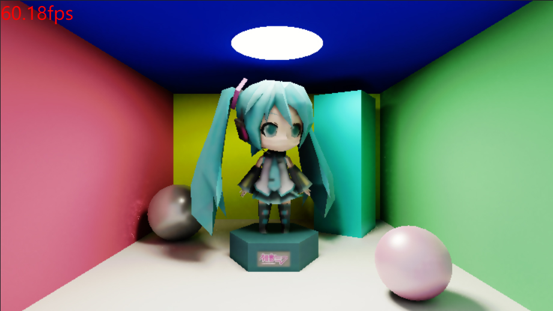

# webgpu-renderer & path-tracing

A simple renderer implemented by WebGPU, includes a builtin path tracing pipeline.

## Path tracing demo

  

Check here: [Path tracing demo](https://dtysky.github.io/webgpu-renderer/)  

>You must use the lasted version of [Chrome Canary](https://www.google.com/intl/en_us/chrome/canary/) and enable the flag `--enable-unsafe-webgpu`.

## Development

First clone this repository, the:

```bash
npm i

npm run dev
```

Then open url `http://127.0.0.1:8888` in your chrome canary.

## Tutorials

>Chinese only now.

1. [概览介绍](https://zhuanlan.zhihu.com/p/407191699)：将会对整个项目涉及的知识做一个综述。  
2. [WebGPU基础与简单渲染器](https://zhuanlan.zhihu.com/p/409670661)：通过自己实现的一个简单渲染器来论述WebGPU的能力。  
3. [路径追踪-场景数据组织](https://zhuanlan.zhihu.com/p/410439684)：针对路径追踪，如何组织场景数据，涉及到PBR材质、glTF、场景合并等。  
4. [路径追踪-管线组织与GBuffer](https://zhuanlan.zhihu.com/p/411213324)：针对路径追踪，如何组织渲染管线，同时论述GBuffer的生成。  
5. [路径追踪-BVH与射线场景求交插值](https://zhuanlan.zhihu.com/p/413989102)：如何构建BVH，以及如何在CS中求交。  
6. [路径追踪-BRDF与蒙特卡洛积分](https://zhuanlan.zhihu.com/p/416164394)：论述如何在路径追踪中运用蒙特卡洛采样实现直接光照和间接光照，以及运用BRDF光照模型。  
7. [路径追踪-降噪与色调映射](https://zhuanlan.zhihu.com/p/416961002)：如何对充满噪点的图像进行空间和时间的滤波，最后输出如何进行色调映射。  
8. [踩坑与调试心得](https://zhuanlan.zhihu.com/p/417269967)：对于WebGPU这样一个实验性的API（至少当时），我是如何进行调试的血泪史（主要是CS部分）。  

## License

Copyright © 2021, 戴天宇, Tianyu Dai (dtysky < [dtysky@outlook.com](mailto:dtysky@outlook.com) >). All Rights Reserved. This project is free software and released under the [MIT License](https://opensource.org/licenses/MIT).
